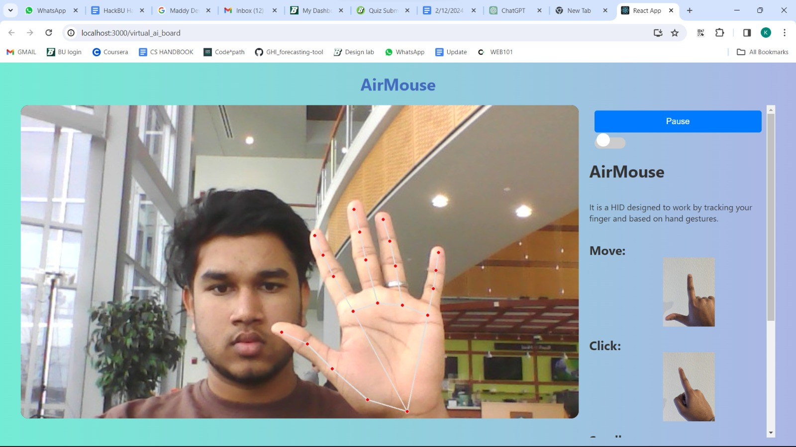
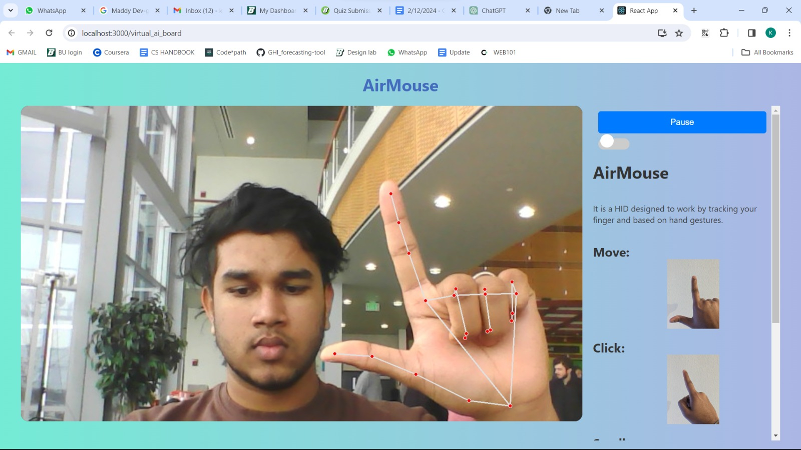
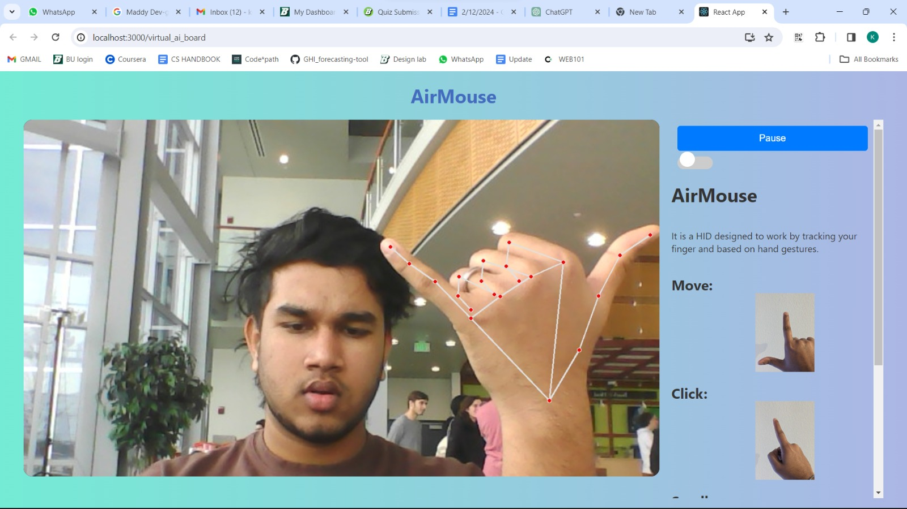
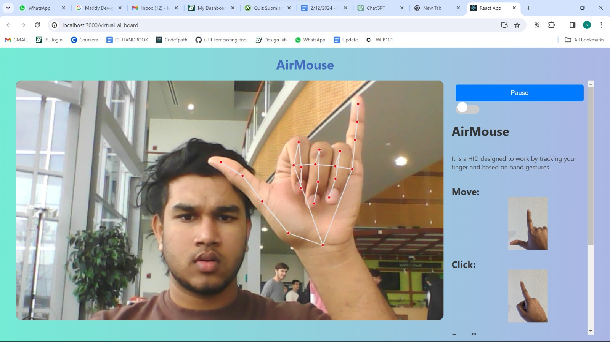

# Air Mouse
*HackBU Hackathon Winning Project* - Control your computer with hand gestures. Click, scroll, and navigate effortlessly. No touch, just motion. Enhance productivity and hygiene seamlessly.

## Inspiration
The inspiration behind Air Mouse stemmed from the team's aspiration to create a more intuitive and natural human-computer interaction. The team drew inspiration from existing gesture recognition technologies in products like Apple Pro Vision, Meta Quest, and VR headsets.

## Project Overview
Air Mouse is a human interface device leveraging a computer's camera to capture hand gestures, enabling the control of the mouse cursor and other elements of the user interface. The project employs a server-client architecture, with the server written in Python using TensorFlow and MediaPipe, and the client written in React.js. The server captures the video feed from the camera, processes it with TensorFlow and MediaPipe, providing a skeleton mesh of the hand.

*Nothing*

*Move Pointer*

*Scroll Up*

*Scroll Down*

## Tech Stack
- **Server:**
  - Language: Python
  - Libraries: TensorFlow, MediaPipe
- **Client:**
  - Framework: React.js
  - Web Technologies: HTML, CSS, JavaScript
- **Other Technologies:**
  - Computer Vision (OpenCV)
  - Version Control: Git
  
